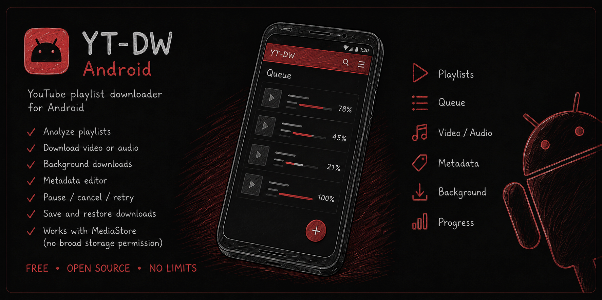

# YT-DW for Android

YouTube playlist downloader



[](https://github.com/feg55/YT-DW-Android/actions/workflows/android.yml)
[](https://github.com/feg55/YT-DW-Android/releases/latest)
[](#download-and-install)
[](https://kotlinlang.org/)
[](https://developer.android.com/compose)
[](LICENSE)

YT-DW is an open-source Android downloader for YouTube videos, audio, and playlists. It analyzes individual links or playlists and saves M4A audio or MP4 video using `yt-dlp` and FFmpeg.

> [!TIP]
> **Looking for the desktop version?** Visit the main **[YT-DW repository →](https://github.com/feg55/YT-DW)** for the Windows desktop application, which can also be run from source on Linux and macOS.

**[Download the latest Android APK →](https://github.com/feg55/YT-DW-Android/releases/latest)**

Use YT-DW only for content you are authorized to download. This project is not affiliated with YouTube or any other supported service, does not override their rules, and does not grant rights to third-party content. The software is provided “as is,” without warranty, support, or author liability to the extent permitted by law.

## Features

- analyzes individual links and playlists;
- previews and edits media metadata;
- downloads M4A audio and MP4 video;
- embeds cover art, title, artist, album, and track number metadata;
- saves files through Android MediaStore without broad storage access;
- provides a background download queue with pause, cancel, and retry actions;
- includes English and Russian interfaces.

Minimum supported version: Android 10 (API 29).

## Download and install

Ready-to-install builds are published on the [GitHub Releases page](https://github.com/feg55/YT-DW-Android/releases). Choose the APK that matches your device:

- `v8-lite` — most modern 64-bit ARM phones and tablets;
- `v7-legacy` — older 32-bit ARM devices;
- `x86-emulator` — Android emulators on a PC;
- `universal` — all supported architectures, with a larger file size.

Before installing, compare the APK SHA-256 checksum with `SHA256SUMS.txt` from the same release. Android may warn about installing an app outside an app store; allow this only for an APK you downloaded from this repository and verified.

## Build from source

You need JDK 17 and the Android SDK with API 36 installed. The Gradle Wrapper downloads the pinned `yt-dlp` version and verifies its SHA-256 checksum.

Windows:

```powershell
.\gradlew.bat check assembleDebug
```

Linux/macOS:

```bash
chmod +x gradlew
./gradlew check assembleDebug
```

The debug APK is written to `app/build/outputs/apk/debug/`.

To build architecture-specific release APKs, a universal APK, and an AAB:

```bash
./gradlew assembleRelease bundleRelease -PreleaseAbiSplits=true
```

## Release signing

Every public APK must be signed with the same permanent key. Otherwise, Android treats the next build as a different application and cannot install it over the previous version.

1. Create a dedicated release keystore and keep a backup outside the repository.
2. Copy `keystore.properties.example` to `keystore.properties`.
3. Enter the keystore path, key alias, and passwords.
4. Run `./gradlew assembleRelease`.
5. Verify the APK certificate with `apksigner verify --verbose --print-certs`.

Never commit `keystore.properties`, a keystore, cookies, or tokens to Git. If a build signed with a different certificate is already installed, uninstall it before installing the new APK. Uninstalling removes the application's data.

The complete publishing procedure is in [RELEASE_CHECKLIST.md](RELEASE_CHECKLIST.md).

Pushing a tag such as `v0.1.3` starts `.github/workflows/release.yml`. The workflow checks the version, builds and verifies signed APK/AAB files, generates SHA-256 checksums, and creates a **draft** GitHub Release. Secret setup instructions are included in the release checklist.

## Permissions and privacy

YT-DW uses internet access and a foreground service for active downloads. Notification permission is requested only when starting the queue on Android 13 or newer. Broad storage access is not required. The app has no proprietary server, user accounts, or analytics collection.

## Limitations and legal notice

Websites may change their APIs, protections, and media formats without notice. Source availability depends on the network, region, and service rules. Users are responsible for complying with service terms, copyright law, and the laws of their country.

## Testing and contributing

Run the project checks with:

```bash
./gradlew check assembleDebug assembleDebugAndroidTest
```

See [CONTRIBUTING.md](CONTRIBUTING.md) before submitting a pull request. Release history is available in [CHANGELOG.md](CHANGELOG.md), and security reports are covered by [SECURITY.md](SECURITY.md).

## License

The project is licensed under the **GNU General Public License v3.0 only (GPL-3.0-only)**. See [LICENSE](LICENSE).

The license permits using, studying, modifying, copying, and distributing the software, including commercially. When distributing a modified application or APK, you must preserve the GPL and copyright notices and provide the corresponding source code. This is required because the APK includes the GPL-licensed `youtubedl-android` library; the complete APK cannot be relicensed under MIT.

Third-party components, licenses, and source links are listed in [THIRD_PARTY_NOTICES.md](THIRD_PARTY_NOTICES.md). The warranty disclaimer and limitation of liability are in sections 15–17 of GPL-3.0.
